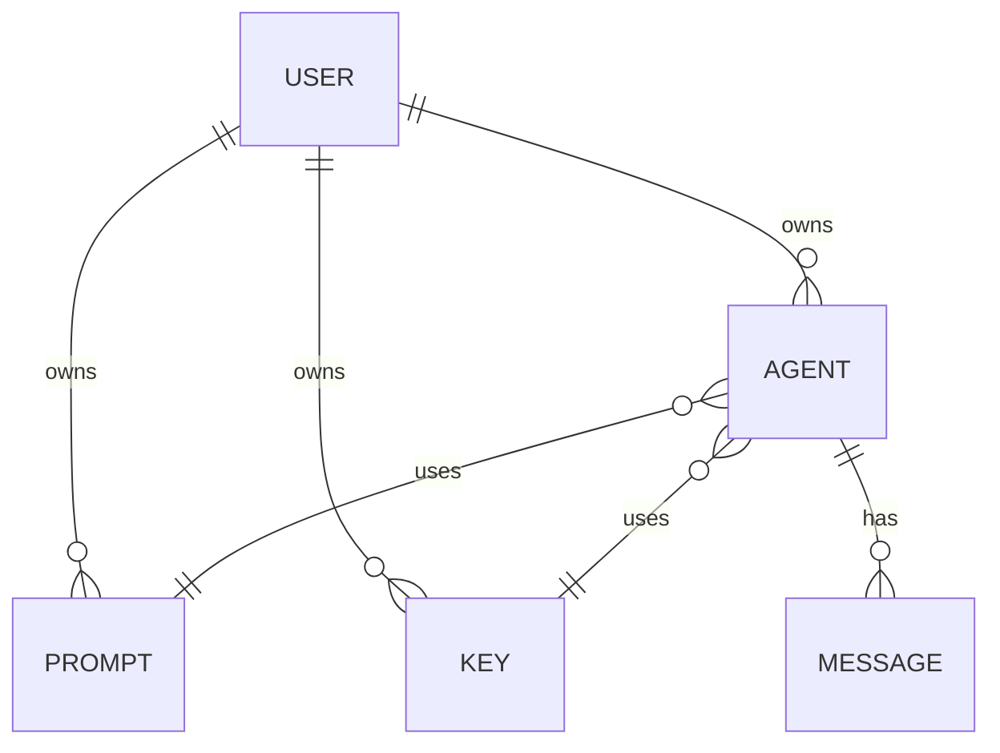
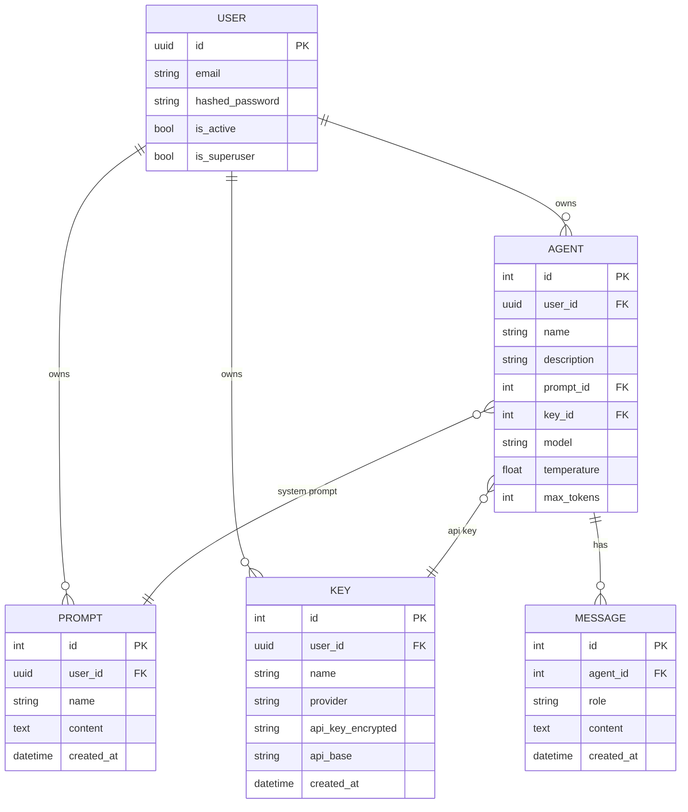
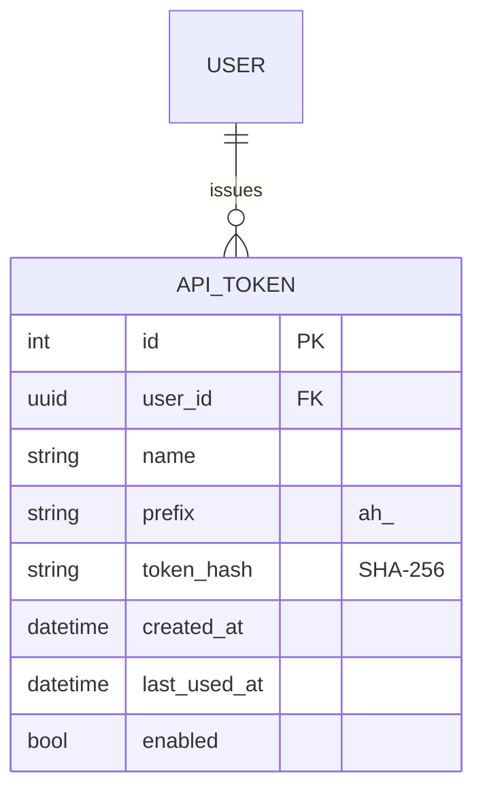
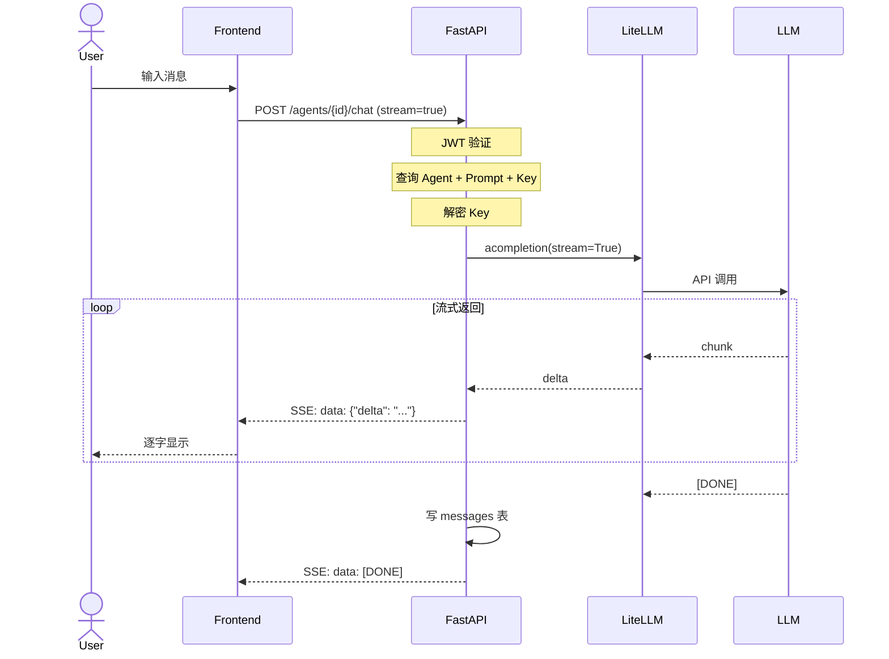
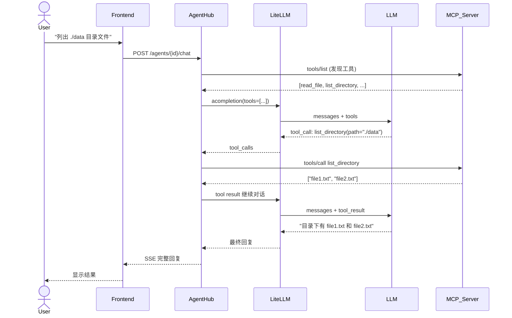
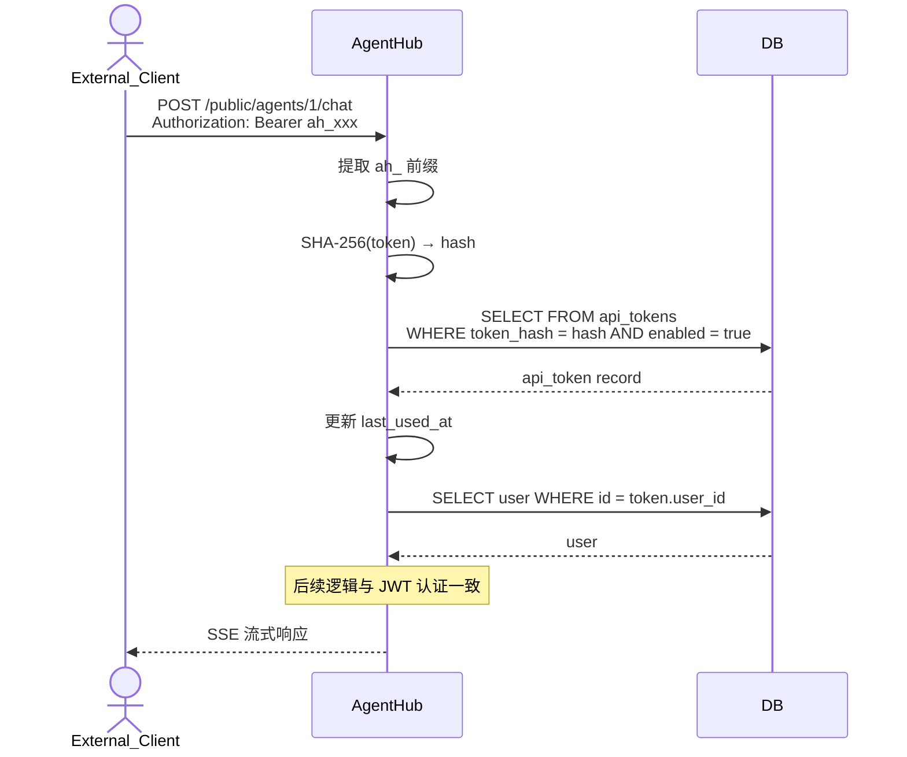
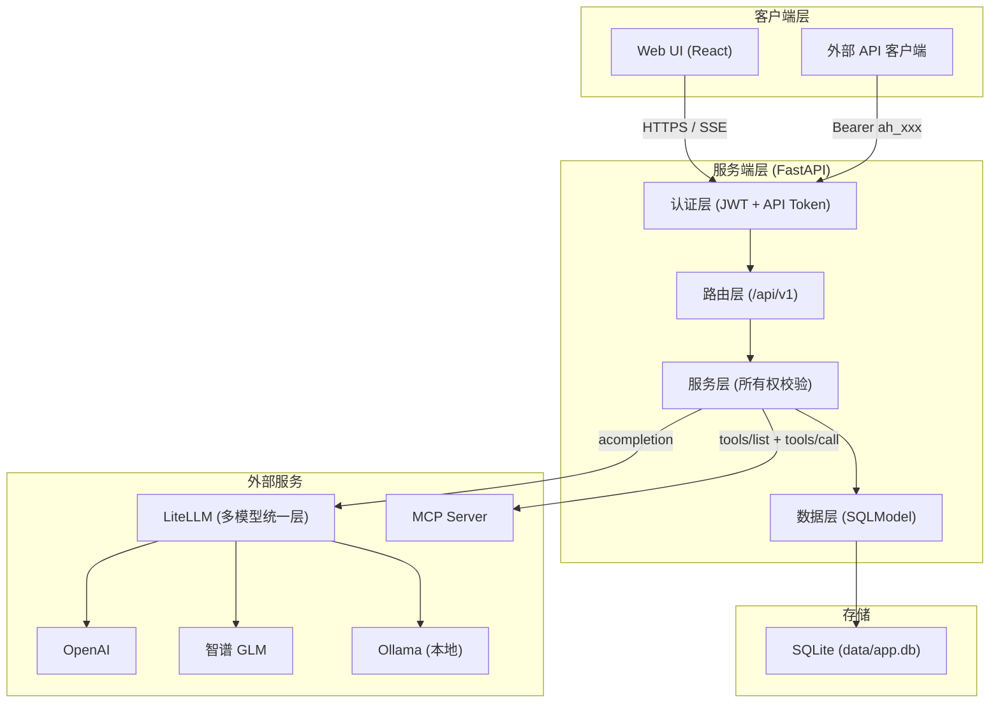
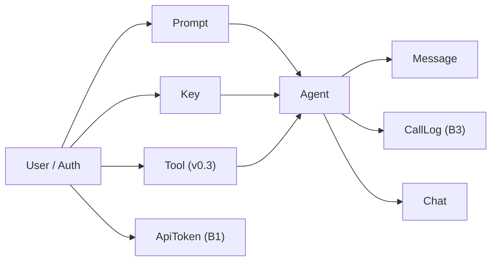
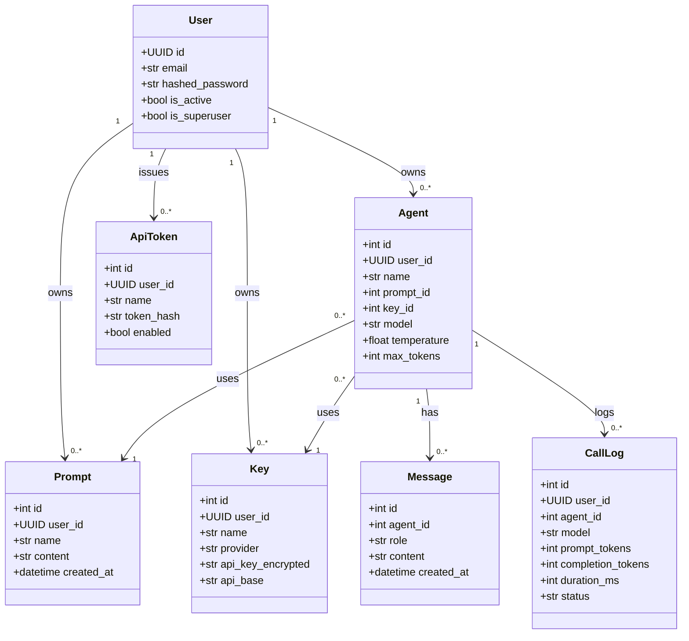

# ref_016 — Mermaid 图表语法（论文素材用）

> 对应任务：B4 论文素材
> 来源：
> - https://mermaid.js.org/syntax/entityRelationshipDiagram.html（ER 图）
> - https://mermaid.js.org/syntax/sequenceDiagram.html（时序图）
> - https://mermaid.js.org/syntax/classDiagram.html（类图）
> - https://mermaid.js.org/syntax/flowchart.html（流程图）
> 可信度：★★★★★ 官方文档
> 最后访问：2026-04-22

---

## 1. ER 图（Entity Relationship）

用于论文「数据库设计」章节。

### 1.1 基本语法



### 1.2 带属性的 ER 图



### 1.3 B1 扩展（加 API_TOKEN）



### 1.4 v0.3 扩展（加 TOOL）

```mermaid
erDiagram
    USER ||--o{ TOOL : registers
    AGENT ||--o{ AGENT_TOOL : has
    TOOL ||--o{ AGENT_TOOL : bound_to
    TOOL {
        int id PK
        uuid user_id FK
        string name
        string server_url
        string auth_type
        bool enabled
    }
    AGENT_TOOL {
        int agent_id PK FK
        int tool_id PK FK
    }
```

---

## 2. 时序图（Sequence Diagram）

用于论文「请求流程」「流式对话」章节。

### 2.1 Chat 请求流（当前实现）



### 2.2 B2 MCP 工具调用流（v0.3）



### 2.3 B1 对外 API Token 认证流



---

## 3. 架构图（Flowchart）

### 3.1 系统分层架构



### 3.2 模块依赖图



---

## 4. 类图（Class Diagram）

用于论文「类设计」章节。



---

## 5. 导出方式

### 5.1 Mermaid Live Editor

访问 https://mermaid.live/edit → 粘贴代码 → 导出 SVG/PNG/PDF

### 5.2 Mermaid CLI

```bash
npm install -g @mermaid-js/mermaid-cli
mmdc -i diagram.mmd -o diagram.svg
mmdc -i diagram.mmd -o diagram.png -w 1200
```

### 5.3 在 Markdown 中渲染

GitHub、VS Code、Typora 原生支持 mermaid 代码块。

### 5.4 draw.io 备选

对于需要更精细控制的架构图，可以用 https://app.diagrams.net（draw.io）：
- 支持导出 SVG/PNG/PDF
- 可以导入 Mermaid 代码
- 模板更丰富

---

## 6. 论文配图清单

| 图号 | 类型 | 内容 | 来源 |
|---|---|---|---|
| 图 3-1 | 架构图 | 系统分层架构 | ref_016 §3.1 |
| 图 3-2 | 模块图 | 模块依赖关系 | ref_016 §3.2 |
| 图 3-3 | ER 图 | 数据库实体关系 | ref_016 §1.2 |
| 图 3-4 | 类图 | 核心类设计 | ref_016 §4 |
| 图 4-1 | 时序图 | Chat 请求流 | ref_016 §2.1 |
| 图 4-2 | 时序图 | MCP 工具调用流 | ref_016 §2.2 |
| 图 4-3 | 时序图 | API Token 认证流 | ref_016 §2.3 |
| 图 5-1 | 流程图 | 前端登录流程 | 待补充 |
| 图 5-2 | 截图 | Swagger UI | 运行后截图 |
| 图 5-3 | 截图 | Dashboard 页面 | 运行后截图 |
